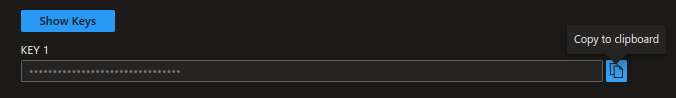

# Creating a Logic App to save information from Tweets inside a spreadsheet using the Azure Portal

---------------------------------------------------------

## Requirements
- Microsoft Azure Account ( with funds or credits )
- Microsoft Azure Suscription
- A Google Account
- A Twitter account
- A web browser

---------------------------------------------------------

## Instructions
#### 1. Login to the [Azure Portal](https://portal.azure.com/).
#### 2. Once your on the portal's home page, you will see something like this:

#### 3. Inside the search bar (located at the top), look for *Logic Apps* and click on it.

#### 4. Click on *Add*.

#### 5. You will now have to configure the project details: select your suscription and resource group. In my case, I'll be creating a new resource group.

#### 6. Now, you need to conigure the instance details: choose a valid name, workflow and the region where your resource will be located.

#### 7. Inside plan, chechk the *Consumption* option.

#### 8. You can add *Tags* if you want by click on the *Tags* button. When you're ready, click *Review + create*.

#### 9. If validation passed, click *Create*.

#### 10. Deployment will begin, please wait a couple of seconds.

#### 11. Once deployment is complete, click on *Go to resource*.

#### 12. Click on *When a new Tweet is posted*.

#### 13. Click *Sign in¨*, then give your connection a name and login using your Twitter account.

#### 14. Click *Continue*.
#### 15. Now, configure the text or hashtag to look for on Twitter as well as how often you'll want to search for it.

#### 16. Click on *New step*, search for *Sentiment* and select *Sentiment* (you may need to scroll down a little).

#### 17. Open another [Azure tab](portal.azure.com)
#### 18. Click on the searchbar an search for *Cognitive services*, then click on it.

#### 19. Click *Create* on *Language Service*.

#### 20. Click *Continue to create your resource* at the bottom of the page.

#### 21. Configure your resource (resource group, region, ame and free tier).

#### 22. Check the *Responsible AI Notice* checkbox.

#### 23. Click *Review + create*.

#### 24. If validation passed, click *Create*.

#### 25. Deployment will begin, please wait a couple of seconds.

#### 26. Once deployment is complete, click on *Go to resource*.

#### 27. Click on *Keys and endpoint*.

#### 28. Copy *KEY1* and paste it inside *Account Key* (in the Logic Apps Designer tab).

#### 29. Copy the *Endpoint* and paste it inside the *Site URL*.

#### 30. Give a name to your connection point and click on *Create*.

#### 31. Select this options while configuring the *Detect Language* connector.

#### 32. Click on *New step* and search for *Google Sheets*, then click on it.

#### 33. Click on *Insert Row*.

#### 34. Create a copy of [this](https://docs.google.com/spreadsheets/d/1VEW8BXIAuSppVLXKWw0iKhzdIk09fNrQaTpp22hUy78/edit?usp=sharing) spreadsheet on your Google Drive account.
#### 35. Go back to Azure and click on *Sign in* and login to your Google account and grant permissions to Azure.
#### 36. Select the file from your Google Drive and worksheet. If the worksheet doesn't appear, click on the three dots, delete and create and repeat step number 32 and 33.

#### 37. Click on *Add new parameter* and then check all boxes.

#### 38. Insert the following options inside every box:

#### 39. Click *Save*.

#### 40. Click *Run Trigger* and then *Run*.

#### 41. After a few seconds, the trigger will run and now you can watch the results on your spreadsheet.

---------------------------------------------------------

## Congratulations ! You've just made your first Azure Function! =)